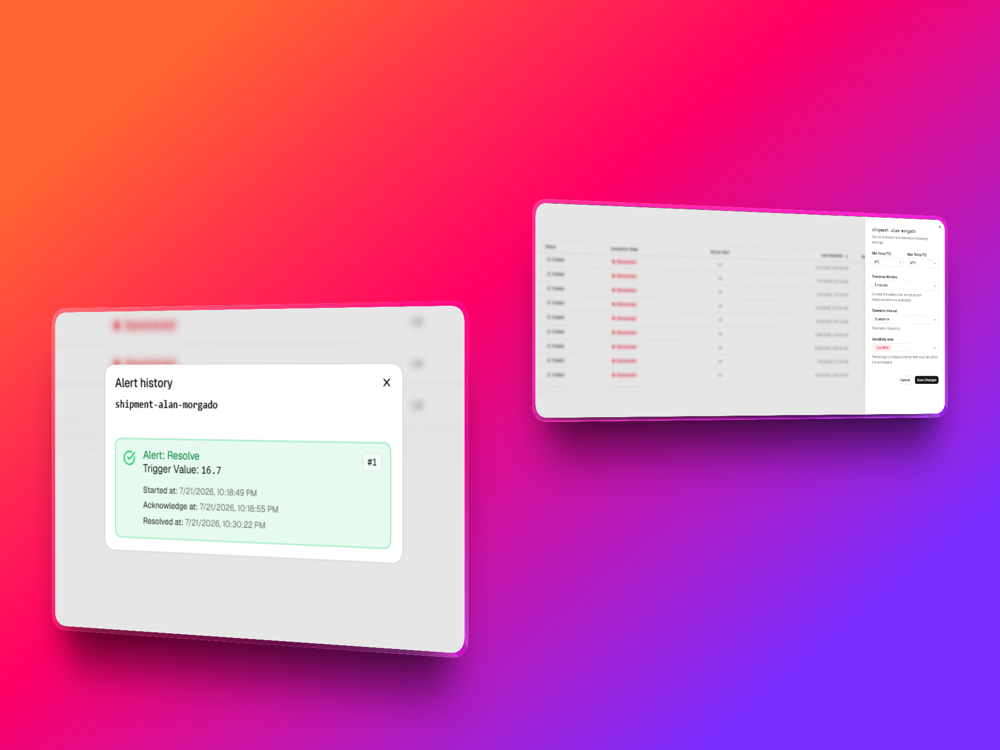

# IoTChallenge

## 🚀 Getting Started / Execution Instructions

This project consists of three main components: 
* **Device Agent:** .NET 10 CLI application (`Device/agent`)
* **Server/API:** Node.js backend (`server`)
* **Web APP:** React frontend (`Cold-chain-Web`)

## 🎥 Video Demo

A complete walkthrough of the project is available on Loom.

👉 **Watch the demo:** https://www.loom.com/share/d2f133b29f48402b97071087c1fc262b



## :triangular_ruler: Design 
> Check out [DESIGN.md](DESIGN.md) to explore the system architecture, design decisions, and data flow.


## Prerequisites

Make sure you have the following installed:
* [.NET 10.0 SDK](https://dotnet.microsoft.com/download) (or higher)
* [Node.js](https://nodejs.org/) (v20 or higher)
* `npm` or `pnpm` / `yarn`
* Git

---

## ⚙️ 1. Environment Configuration

Before running any service, you must configure the environment variables for each component.

### 1.1 Device Agent (.NET)

Navigate to the `Device` directory, create your local configuration file from the template, and set your Azure IoT Hub device connection string:

```bash
cd Device
cp agent/appsettings.json.example agent/appsettings.json

```

Edit `agent/appsettings.json` or set the environment variable:

```bash
# PowerShell
$env:IOT_DEVICE_CONNECTION_STRING = "HostName=...;DeviceId=shipment-001;SharedAccessKey=..."

# bash
export IOT_DEVICE_CONNECTION_STRING="HostName=...;DeviceId=shipment-001;SharedAccessKey=..."
```

### 1.2 Server / API (Node.js)
Navigate to the server directory and copy the example environment file:

```bash
cd server
cp .env.example .env
```
Open .env and configure your port and add your azure iothub string connection and iot event hub string connection:

```bash
PORT=5000

IOTHUB_CONNECTION_STRING="HostName=...;SharedAccessKeyName=...;SharedAccessKey=..."

IOTHUB_EVENT_HUBS_CONNECTION_STRING="Endpoint=...;SharedAccessKeyName=...;SharedAccessKey=...;EntityPath=..."
```

### 1.3 Web App (React)
Navigate to the Cold-chain-Web directory and copy the example environment file:

```bash
cd Cold-chain-Web
cp .env.example .env
```
Open .env and configure your backend API base URL:

```bash
cd Cold-chain-Web
cp .env.example .env
```
Open .env and configure your backend API base URL and Local host:

```bash
VITE_DEVICES_API_URL=http://localhost:5000/iot/devices

VITE_LOCAL_HOST=http://localhost:5000
```


NOTE: You need to provide the same PORT where the server is running to the web app (VITE_API_URL). In this case, port 5000 must match in both environments.


### 2. Running Services Individually

Open a separate terminal window/tab for each service in order to run them concurrently.

#### :pager: 2.1 Device Agent (.NET CLI)

1. Build the agent
```bash
cd Device

dotnet build agent
```

2. Run device project
```bash
dotnet run --project agent -- connect --device-id shipment-001
```

## Agent CLI reference

```bash
# Connect and send telemetry every 30 seconds (Ctrl+C to stop)
dotnet run --project agent -- connect --device-id shipment-001

# Custom interval
dotnet run --project agent -- connect --device-id shipment-001 --interval-seconds 15

# Send a single telemetry message
dotnet run --project agent -- send --device-id shipment-001 --temperature 8.4

# Simulate a high-temperature event (several readings)
dotnet run --project agent -- simulate-alarm --device-id shipment-001 --cycles 5

# Show local device state
dotnet run --project agent -- status

# Display full command line reference
dotnet run --project agent -- --help
```
---


### :satellite: 2.2 Server (Node JS)

1. Install dependencies:

```bash
cd server

npm install
```

2. Run dev server:

```bash
npm run dev
```

### :computer: 2.3 Web App (React)

1. Install dependencies:
```bash
cd Cold-chain-Web

npm install
```

2. Run web app:

```bash
npm run dev
```

Once started, open your browser at the local URL indicated in the terminal (e.g. http://localhost:5173)
